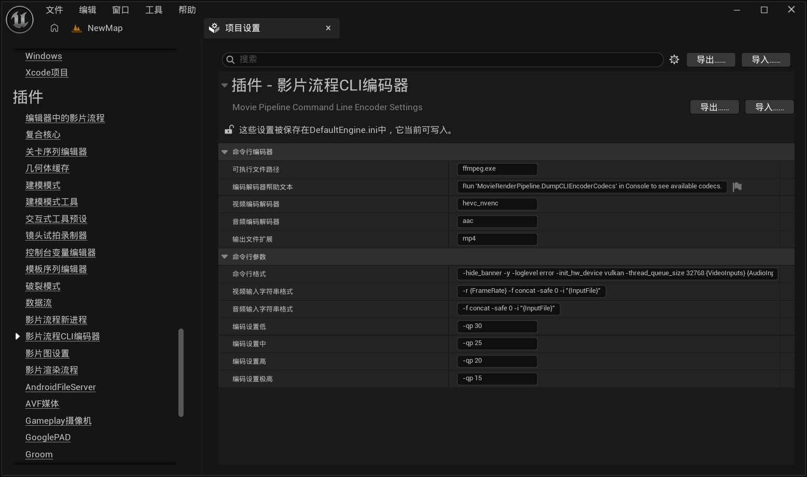
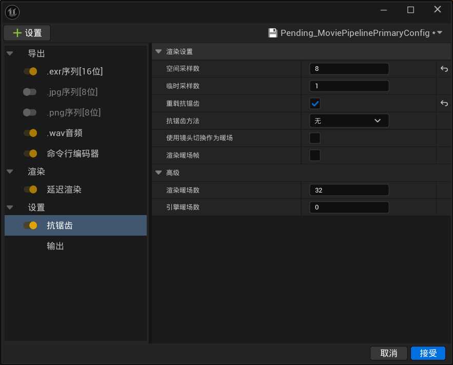

# IVP5U 详细教程

## UE5 MMD教程

UE5.5 MMD教程 替代Blender渲染 VRM4U IVP5U NexGiMa FFmpeg  
<https://www.bilibili.com/video/BV1EbEzzrED9/>  
UE5.2 动画製作: VRM4U导入PMX模型 + IVP5U导入VMD动作  
<https://www.bilibili.com/video/BV17p4y1K7MM/>  
UE5.2 动画製作: 使用 IVP5U 导入MMD模型、动作和镜头  
<https://www.bilibili.com/video/BV1Ju4y197Pz/>  

## MMDBridge烘焙物理

MMDBridge下载  
<https://github.com/rintrint/mmdbridge>  
MMDBridge教程  
<https://www.bilibili.com/opus/1102730546871533640>  
<https://github.com/rintrint/mmdbridge/blob/master/docs/how_to_use.md>  

## 注意事项

修改UE5项目设置:

* 开启支持16位骨骼索引 - 支持超过256根骨骼的模型(MMD模型基本都会超过)
* 开启光线追踪阴影 - 解决阴影有锯齿的问题
* 关闭自动曝光
* 关闭动态模糊
* Substrate GBuffer格式: Adaptive GBuffer
* Substrate Closure Per Pixel: 根据需求调大
* Substrate Bytes Per Pixel: 根据需求调大
* Near Clip Plane: 根据需求调小(解决镜头太靠近模型时发生裁剪问题)

导入模型后建议先存档并重启UE5  
未重启就导入VMD会导致动画鬼畜，有时还会导致UE5卡死或闪退  

模型的骨骼名称和表情名称尽量不要包含以下字符，UE5的骨骼名称和动画曲线不支持这些字符  

```text
!"#$%&' ()*+,-./:;<=>?@[]^`{|}~
```

## UE5输出视频

ffmpeg下载(二选一)，并设置环境变数  
<https://github.com/BtbN/FFmpeg-Builds/releases> 选择ffmpeg-master-latest-win64-gpl-shared.zip  
<https://www.gyan.dev/ffmpeg/builds> 选择ffmpeg-git-full.7z  

设置Movie Pipeline CLI Encoder  


这个可以根据自己需求自定义，问AI即可，AI对ffmpeg很熟悉  

```text
ffmpeg.exe
Run 'MovieRenderPipeline.DumpCLIEncoderCodecs' in Console to see available codecs.
hevc_nvenc
aac
mp4
-hide_banner -y -loglevel error -init_hw_device vulkan -thread_queue_size 32768 {VideoInputs} {AudioInputs} -c:v {VideoCodec} -c:a {AudioCodec} {Quality} -vf "libplacebo=colorspace=bt709:color_primaries=bt709:color_trc=iec61966-2-1:range=tv:format=yuv444p16le" -pix_fmt yuv420p -g 60 -b:a 320k -ar 48000 -movflags +faststart -flags +cgop -coder cabac {AdditionalLocalArgs} "{OutputPath}"
-r {FrameRate} -f concat -safe 0 -i "{InputFile}"
-f concat -safe 0 -i "{InputFile}"
-qp 30
-qp 25
-qp 20
-qp 15
```

也可以使用cmd指令手动编码视频，示范如下  

```text
ffmpeg -hide_banner -y -init_hw_device vulkan -thread_queue_size 32768 -r 60 -i NewLevelSequence.%4d.exr -i NewLevelSequence.wav -c:v hevc_nvenc -c:a aac -qp 20 -vf "libplacebo=colorspace=bt709:color_primaries=bt709:color_trc=iec61966-2-1:range=tv:format=yuv444p16le" -pix_fmt yuv420p -g 60 -b:a 320k -ar 48000 -movflags +faststart -flags +cgop -coder cabac "qp 20.mp4"
```

### 渲染设置建议

渲染时开启抗锯齿选项将重载抗锯齿打勾，将抗锯齿方法设为无来关闭抗锯齿。  
将空间採样数提高到 8 以上来解决锯齿和闪烁。  
採样数越高画质越高，这会显着增加渲染时间。  



**后期处理体积 (Post Process Volume)**:

* 勾选无限范围
* 可以些微拉高对比
* 可以拉高 Lumen 的质量
